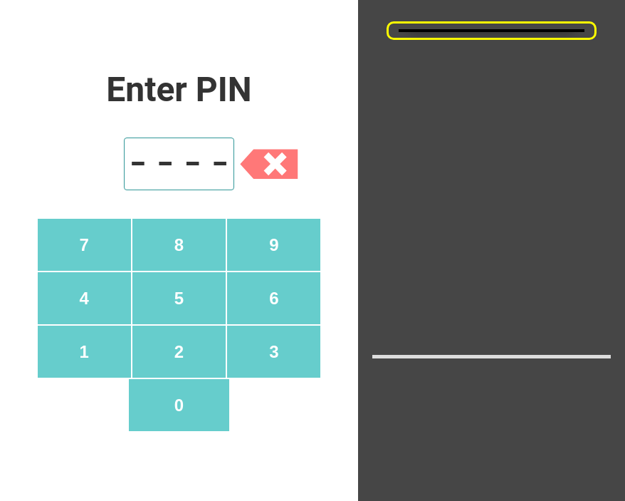
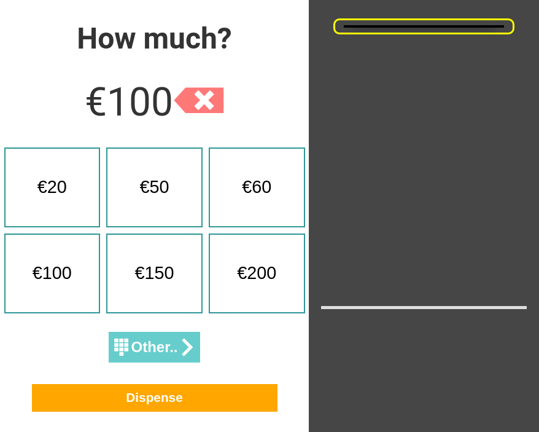
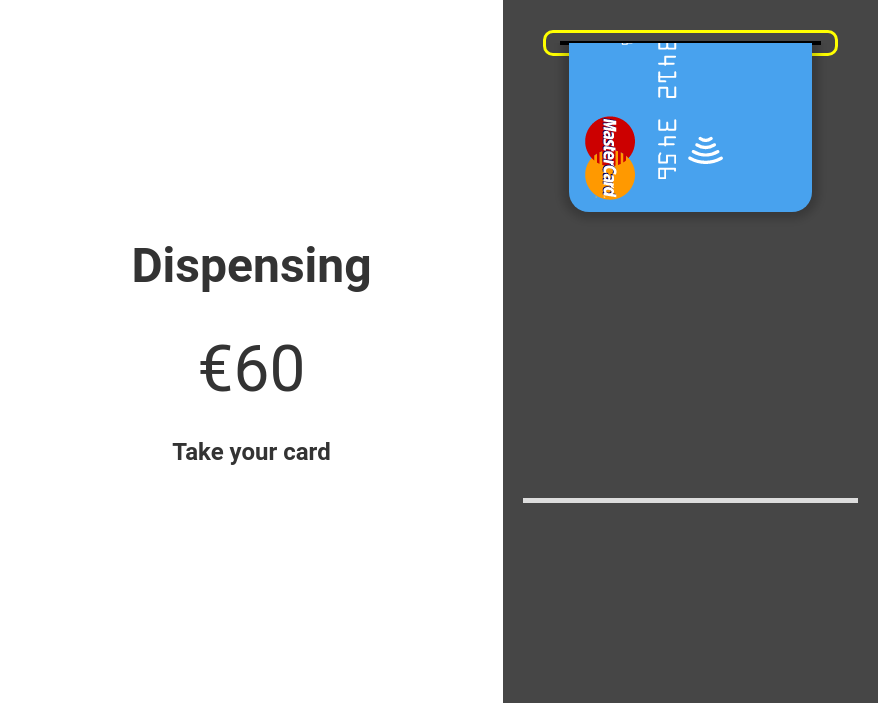
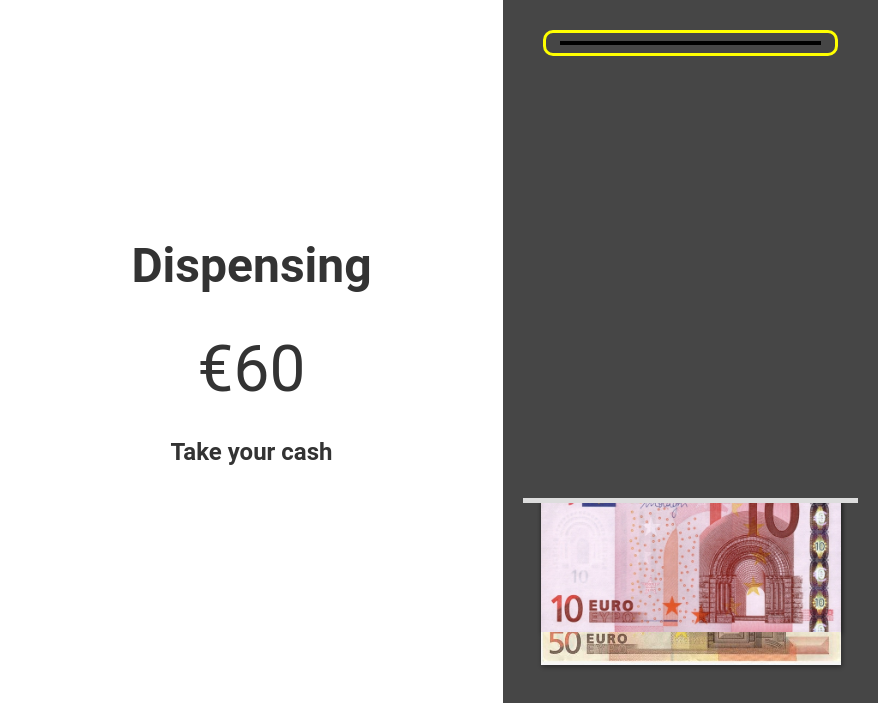

# ATM Challenge

A mock Automated Teller Machine in HTML5, created over two days as a coding challenge.

View live [here](https://joshua-shone.github.io/atm-challenge). Use ```1234``` as the PIN.

| - | - |
| --- | --- | 
|   |  |
|   |  |
|   |

## Running locally

```sh
git clone <this repository>
cd ./atm-challenge
npm install
npm start
```

Open ```localhost:8080``` in a web browser, and click the credit card to begin. Use ```1234``` as the PIN.

## About

The ATM interface is encapsulated into a [Polymer](https://www.polymer-project.org/) module, with the keypad interface also separated into a reusable component. All graphics are implemented with scalable vector files or CSS, aside from JPGs for currency. The minimal dependencies are managed with NPM and Bower.

Tested on Chrome 50 and Firefox 45.

Theme colors and design inspired by [Number26](https://number26.eu/)
